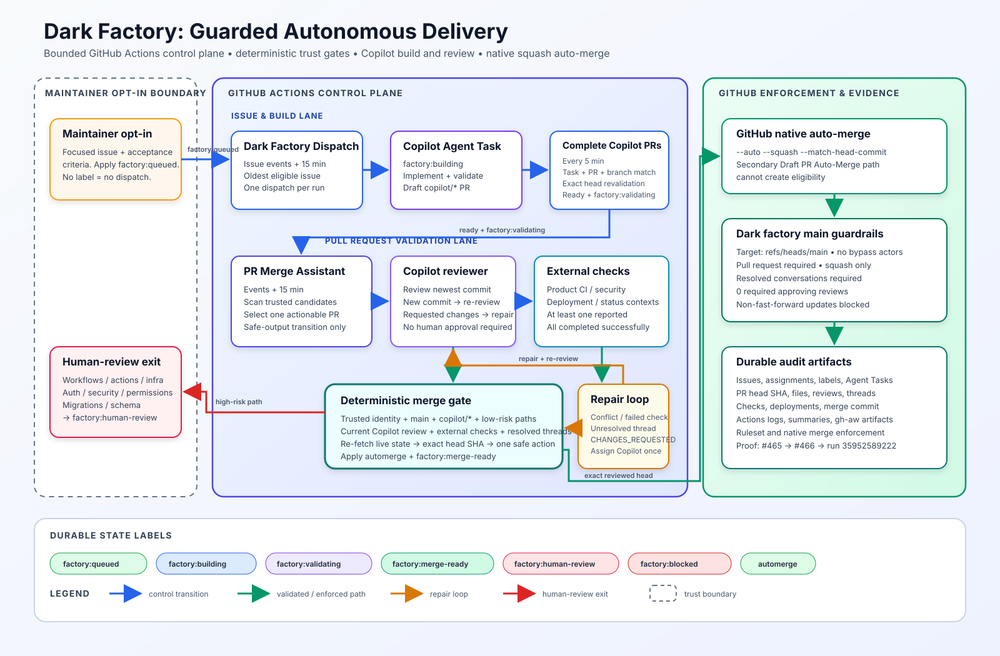

# Dark Factory Enterprise Architecture



This guide is the authoritative architecture and workflow reference for the live dark factory in `VeVarunSharma/contoso-vibe-engineering`. It documents the implementation on the default `main` branch and the repository settings verified on September 24, 2026. For the shorter operator checklist, see [Dark Factory Operations](dark-factory.md).

## Purpose and operating model

The dark factory is an opt-in, bounded delivery system for low-risk repository work. A maintainer supplies intent and acceptance criteria in a GitHub issue, then explicitly enters that issue into the factory with `factory:queued`. GitHub issues, pull requests, labels, reviews, checks, workflow runs, and branch rules are the durable control state. GitHub Actions provides the control plane, the Copilot coding agent performs implementation and repair, Copilot code review supplies the automated review gate, and GitHub native auto-merge performs the final squash merge.

The operating model deliberately separates probabilistic agent work from deterministic authorization:

- Agents may implement a scoped issue, summarize state, or choose only among precomputed safe-output transitions.
- Shell and `jq` steps establish identity, repository, branch, label, review, check, path-risk, and head-SHA facts.
- Privileged safe-output jobs re-read live GitHub state before changing assignments, labels, review requests, or auto-merge.
- The `Dark factory main guardrails` ruleset remains the final server-side enforcement boundary.
- Eligible low-risk changes require no human approval. High-risk changes leave the autonomous path and require human review.
- Dispatch and reconciliation process at most one actionable item per run, limiting blast radius and making each transition auditable.

## Control-plane inventory

Agentic workflow Markdown is source code. Its generated `.lock.yml` counterpart is the executable GitHub Actions workflow and must not be edited directly.

| Component | Source file | Executable workflow | Trigger and cadence | Concurrency and bound |
| --- | --- | --- | --- | --- |
| **Dark Factory Dispatch** | `.github/workflows/dark-factory-dispatch.md` | `.github/workflows/dark-factory-dispatch.lock.yml` | `issues` on `labeled` or `reopened`; manual dispatch; every 15 minutes | Repository-wide `dark-factory-dispatch`, no cancellation; oldest eligible issue; one issue per run |
| **Complete Copilot PRs for Factory Validation** | `.github/workflows/complete-copilot-prs.yml` | Same file | Manual dispatch; every 5 minutes | Repository-wide `complete-copilot-prs`, no cancellation; scans up to 100 current tasks and pull requests |
| **Label Copilot PRs for Factory Validation** | `.github/workflows/label-copilot-prs.yml` | Same file | `pull_request_target` on `opened`, `reopened`, or `ready_for_review` | Per pull request, no cancellation; event-driven validation-label backstop |
| **PR Merge Assistant** | `.github/workflows/pr-merge-assistant.md` | `.github/workflows/pr-merge-assistant.lock.yml` | `pull_request_target` on `ready_for_review`, `synchronize`, `reopened`, or `labeled`; manual dispatch; every 15 minutes | Repository-wide `pr-merge-assistant`, no cancellation; one actionable pull request per run |
| **Draft PR Auto-Merge** (secondary path) | `.github/workflows/draft-pr-automerge.md` | `.github/workflows/draft-pr-automerge.lock.yml` | `pull_request_target` on `ready_for_review`, `labeled`, or `reopened`, for Copilot bots, and only when no longer a draft | Per pull request with cancellation; revalidates only the triggering pull request and head SHA |
| **Main branch enforcement** | Repository ruleset | `Dark factory main guardrails` | Every update to `refs/heads/main` | GitHub server-side enforcement; no workflow can bypass it |

The completion workflow is the trusted scheduled bridge from GitHub Agent Tasks to pull-request readiness. The event-driven label workflow remains a supplementary backstop for trusted Copilot pull requests. The Draft PR Auto-Merge workflow is a secondary, duplicate-safe path: it cannot create eligibility; it only acts after the merge controller has already applied both `automerge` and `factory:merge-ready`.

## End-to-end lifecycle

1. **Maintainer opt-in.** A maintainer creates a focused issue with testable acceptance criteria and applies `factory:queued`. Unlabeled issues never enter the factory.
2. **Bounded dispatch.** Dark Factory Dispatch selects the oldest open queued issue that is not blocked, not routed to human review, and not already assigned to Copilot. Its safe-output job revalidates those facts, assigns `copilot-swe-agent[bot]` through the Agent Task API, removes `factory:queued`, adds `factory:building`, and records a dispatch comment.
3. **Agent Task and draft pull request.** The coding agent works only the assigned issue, follows repository instructions, validates the change, and opens a draft pull request from a same-repository `copilot/*` branch.
4. **Trusted completion and readiness.** Every five minutes, Complete Copilot PRs for Factory Validation reads completed Agent Tasks with `COPILOT_AGENT_TASKS_TOKEN` and open pull requests with `PR_MERGE_AUTOMATION_TOKEN`. It requires the immutable Copilot bot ID `198982749`, login `Copilot`, type `Bot`, the same repository, a `copilot/*` branch, a matching pull-request artifact, a matching branch artifact, and an unchanged pull-request ID, head ref, and head SHA. It then applies `factory:validating` and marks the draft ready for review.
5. **Automated review.** PR Merge Assistant considers only open, non-draft, Copilot-authored pull requests targeting `main` from `copilot/*`, labeled `factory:validating`, and not labeled `factory:human-review`. If no Copilot review is current for the newest commit, it requests `copilot-pull-request-reviewer[bot]`.
6. **External validation.** Product CI, security checks, deployment checks, and status contexts execute independently. The controller waits for at least one external check and requires every external result to satisfy the merge policy.
7. **Repair loop.** A merge conflict, a failing external check, `CHANGES_REQUESTED`, or an unresolved review thread selects `assign_agent`. The safe-output job refreshes the Copilot assignment and adds `changes-requested`. While that repair marker remains, the pull request waits. A new commit invalidates the old review and causes another Copilot review request.
8. **Deterministic merge-ready transition.** When all gates pass, the safe-output job re-fetches live state, recounts unresolved threads, captures the exact current head SHA, applies `automerge` and `factory:merge-ready`, and runs `gh pr merge --auto --squash --match-head-commit <sha>`.
9. **Native merge enforcement.** GitHub native auto-merge waits for repository rules and merges only the matched head commit. The `Dark factory main guardrails` ruleset requires a pull request, allows squash only, requires resolved conversations, requires zero approving reviews, and blocks non-fast-forward updates.
10. **Issue closure and durable evidence.** The squash merge closes a linked issue through normal GitHub semantics. The issue, pull request, labels, review, check rollup, ruleset decision, workflow logs, and generated workflow artifacts remain available for audit.

## Durable label state machine

Labels are persistent coordination state, not merely decoration. Transitions are monotonic where possible, while stop and repair states intentionally interrupt the happy path.

| Label | Applies to | Meaning and entry condition | Normal exit |
| --- | --- | --- | --- |
| `factory:queued` | Issue | Explicit maintainer authorization for autonomous dispatch | Removed after successful Agent Task assignment |
| `factory:building` | Issue | Copilot coding agent has been assigned | Issue closes when its pull request merges; the label remains as delivery history |
| `factory:validating` | Pull request | Trusted Copilot pull request is ready for automated review and checks | Remains through merge as audit state |
| `factory:merge-ready` | Pull request | Deterministic review, check, thread, path, and head gates passed | Native auto-merge merges the exact eligible head; removed if high risk is later detected |
| `factory:human-review` | Issue or pull request | Autonomous processing is prohibited or has been stopped | Human owners decide remediation and disposition |
| `factory:blocked` | Issue | Operator-visible stop marker for work that automation must not dispatch | Maintainer removes it after resolving the blocker |
| `automerge` | Pull request | Explicit guarded opt-in for GitHub native auto-merge | Pull request merges, closes, or loses eligibility |

`changes-requested` is an internal repair marker used by PR Merge Assistant. It prevents repeated assignments while the coding agent is already expected to repair the pull request. It is not one of the public factory lifecycle labels.

## Deterministic trust and merge gates

### Identity and provenance

The trusted readiness path requires all of the following:

- Pull-request author ID is `198982749`, login is `Copilot`, and type is `Bot`.
- The head repository is the current repository, preventing fork-based privilege confusion.
- The head branch starts with `copilot/`.
- The Agent Task is `completed` and contains both a pull artifact matching the pull-request database ID and a branch artifact matching the head ref.
- The live pull request still has the evaluated ID, head ref, and head SHA immediately before readiness is changed.

PR Merge Assistant accepts the GitHub-rendered Copilot identities `app/copilot-swe-agent` or `Copilot`, still requires a same-purpose `copilot/*` branch targeting `main`, and requires `factory:validating`.

### Exact-head review and revalidation

A Copilot review is current only when the latest review from an author whose login starts with `copilot-pull-request-reviewer` was submitted at or after the newest commit time. If a newer commit appears, the controller does not treat the earlier review as approval; it requests review again. Before enabling auto-merge, the privileged job re-fetches the pull request, recomputes every gate, captures `headRefOid`, and uses `--match-head-commit`. The secondary Draft PR Auto-Merge path additionally requires its agent output to match both the triggering pull-request number and triggering event SHA, then checks the live SHA again.

### External-check filtering

The merge controller excludes check runs whose workflow name is one of:

- `PR Merge Assistant`
- `Draft PR Auto-Merge`
- `Label Copilot PRs for Factory Validation`

These are orchestration checks and may legitimately contain skipped or cancelled jobs. Everything else is treated as external validation. The gate requires:

- At least one non-factory check or status context is reported.
- Every non-factory `CheckRun` is `COMPLETED` with conclusion `SUCCESS`, `NEUTRAL`, or `SKIPPED`.
- Every non-factory `StatusContext` is `SUCCESS`.
- Unknown rollup types fail closed.
- Pending checks wait; failed checks enter repair.

This keeps product, security, and deployment evidence mandatory without letting the control plane deadlock on its own bookkeeping jobs.

### Conversations and actionable bounds

Review threads are fetched separately through GraphQL. Any unresolved thread blocks merge and selects repair. The merge safe-output job fetches thread state again immediately before applying merge-ready labels, closing the time-of-check/time-of-use gap.

The controller scans candidate pull requests, computes deterministic actions, drops candidates that are only waiting, and selects exactly one actionable item. Priority is high-risk human review, merge-ready, review request, then repair assignment; ties use creation time and pull-request number. A waiting pull request does not block another actionable pull request. Dark Factory Dispatch similarly selects one oldest eligible issue. Neither workflow recursively dispatches follow-up runs.

## Autonomous eligibility and human-review exit

No human approval is required for an otherwise eligible low-risk pull request. The current Copilot review, green external checks, resolved conversations, exact-head match, and repository ruleset form the approval chain. The ruleset intentionally sets `required_approving_review_count` to `0`.

The controller fails out of autonomous delivery when any changed path matches:

- `.github/workflows/`
- `.github/actions/`
- `infra/`
- A path segment or file name matching authentication, security, or permission concerns
- A path segment or file name matching database migration or schema concerns

For these workflow, action, infrastructure, auth, security, permissions, migration, and schema changes, the controller removes `automerge` and `factory:merge-ready`, applies `factory:human-review`, and takes no merge action. Human-authored and Dependabot pull requests are also outside this factory.

## Tokens, secrets, and least privilege

Secret values must never appear in issues, pull requests, logs, documentation, or workflow inputs. The live factory uses these credentials:

| Token or secret | Used by | Least-privilege purpose |
| --- | --- | --- |
| `GITHUB_TOKEN` | Read-only deterministic prefetch in agentic workflows; Draft PR Auto-Merge safe output | Read repository and pull-request state; for the secondary path, write only the pull-request/contents permissions needed to enable native auto-merge |
| `COPILOT_AGENT_TASKS_TOKEN` | Complete Copilot PRs for Factory Validation | Read GitHub Agent Task state and artifacts from `/agents/repos/{owner}/{repo}/tasks` |
| `PR_MERGE_AUTOMATION_TOKEN` | Dispatch, readiness labeling, review/repair transitions, and primary merge safe outputs | Assign Copilot, manage factory labels, request Copilot review, read checks and conversations, and enable exact-head native auto-merge |

Generated gh-aw workflows also use framework-managed runtime tokens and artifacts. Treat those as implementation details of the compiled workflows and preserve the permissions declared in the Markdown source. Do not broaden repository-wide token scopes to compensate for a missing job permission; change the smallest workflow or fine-grained token permission that satisfies the required API operation.

## Main branch ruleset

The active branch ruleset is named **Dark factory main guardrails** and targets only `refs/heads/main`. It has no bypass actors and enforces:

- Changes must enter through a pull request.
- The only allowed merge method is squash.
- All review conversations must be resolved.
- Required approving review count is zero.
- Non-fast-forward updates are blocked.

The repository has native auto-merge and squash merging enabled. Although the repository generally permits other merge methods, this ruleset restricts `main` to squash. The ruleset is the final control boundary: workflow success alone never authorizes a direct update to `main`.

## Repair, failure, and concurrency behavior

- **Dispatch failure:** the issue remains durable and can be reconciled again. `factory:blocked` can be applied to prevent redispatch while an operator investigates.
- **Missing or stale Agent Task evidence:** the completion workflow leaves the pull request unchanged and retries on the next five-minute run.
- **Changed pull request during evaluation:** exact ID/ref/SHA checks fail closed and no readiness or merge action occurs.
- **Review pending:** the controller waits after one current review request rather than creating duplicates.
- **Check, thread, conflict, or requested-change failure:** Copilot is assigned for repair once and `changes-requested` suppresses duplicate assignments.
- **New commit after review:** the review is stale and a new Copilot review is required.
- **High-risk path:** auto-merge labels are removed and `factory:human-review` is applied.
- **No external checks:** merge is prohibited even if the Copilot review is current.
- **Workflow overlap:** dispatch and merge-controller concurrency groups serialize repository-wide mutations. Completion is also serialized. Draft PR Auto-Merge serializes per pull request and cancels stale in-progress runs.
- **Agentic workflow failure reporting:** automatic failure issues and transition comments are disabled to avoid noise. GitHub Actions conclusions, logs, summaries, and uploaded gh-aw activation/agent/detection artifacts remain the primary diagnostic record.

## Operations and troubleshooting

Run commands from an authenticated checkout of the repository:

```powershell
# Show source/generated workflow health
gh aw status

# Compile after changing agentic Markdown sources
gh aw compile dark-factory-dispatch pr-merge-assistant draft-pr-automerge --approve --actionlint --validate

# Manually start bounded reconciliation
gh aw run dark-factory-dispatch
gh workflow run complete-copilot-prs.yml
gh aw run pr-merge-assistant

# Inspect queued issues and active factory pull requests
gh issue list --label "factory:queued" --state open
gh pr list --label "factory:validating" --state open

# Inspect a pull request's live checks, labels, review state, and head SHA
gh pr view <number> --json author,baseRefName,headRefName,headRefOid,isDraft,labels,reviews,reviewDecision,statusCheckRollup,files

# Inspect workflow runs and download retained artifacts
gh run list --workflow pr-merge-assistant.lock.yml --limit 20
gh run view <run-id> --log
gh run download <run-id>

# Inspect the active main-branch ruleset
gh api repos/VeVarunSharma/contoso-vibe-engineering/rulesets
```

Troubleshoot from the outer boundary inward:

1. Confirm the issue or pull request has the expected durable labels.
2. Confirm workflow triggers and concurrency did not leave a newer run queued.
3. Confirm Copilot identity, same-repository branch, base branch, and exact head SHA.
4. Confirm the newest commit has a newer or equal Copilot review timestamp.
5. Separate external checks from the three filtered factory workflow names.
6. Query unresolved review threads and merge conflict state.
7. Inspect changed paths for high-risk matches.
8. Inspect the safe-output job, because it is the authoritative revalidation and mutation boundary.
9. Confirm native auto-merge and the `Dark factory main guardrails` ruleset are active.

## Auditability

Every meaningful decision leaves one or more durable records:

- Issue labels, assignment, dispatch comment, Agent Task linkage, and closure.
- Pull-request author, head branch/SHA, changed files, lifecycle labels, assignments, and merge commit.
- Copilot review request and timestamped review result.
- External check rollup, deployment statuses, and review-thread resolution.
- GitHub Actions run event, source SHA, job conclusions, logs, summaries, and retained gh-aw artifacts.
- Native auto-merge request with exact-head matching.
- Repository ruleset definition and server-side merge enforcement.

Because the controller performs one actionable transition per run, an operator can reconstruct the state machine by ordering workflow runs and GitHub timeline events without relying on ephemeral agent memory.

## Verified autonomous merge proof

The live system completed an end-to-end autonomous delivery on September 24, 2026:

- Issue [#465](https://github.com/VeVarunSharma/contoso-vibe-engineering/issues/465), **[Docs] Update workflow-noise guidance for bounded factory reconciliation**, was assigned to Copilot and remained labeled `factory:building`.
- Copilot opened [#466](https://github.com/VeVarunSharma/contoso-vibe-engineering/pull/466) from `copilot/update-workflow-noise-guidance` to `main`, changing only `docs/workflow-noise-reduction.md`.
- The Copilot reviewer submitted a `COMMENTED` review at `2026-09-24T03:29:55Z`.
- External Vercel preview and deployment statuses succeeded. Factory orchestration checks included expected skipped and cancelled jobs and were filtered from the external gate.
- [PR Merge Assistant run 35952589222](https://github.com/VeVarunSharma/contoso-vibe-engineering/actions/runs/35952589222) completed successfully. Its `enable_pr_automerge` job succeeded while repair, review-request, and human-review jobs were skipped.
- PR #466 received `automerge`, `factory:validating`, and `factory:merge-ready`, then GitHub native auto-merge squash-merged it at `2026-09-24T03:46:24Z` as commit `eb814af25e42448ec5352160e73d4499f3011ecd`.
- The merge closed #465 one second later.

This example proves the intended no-human-approval path for a low-risk documentation change while preserving deterministic review, external checks, exact-head matching, native auto-merge, and main-branch ruleset enforcement.
